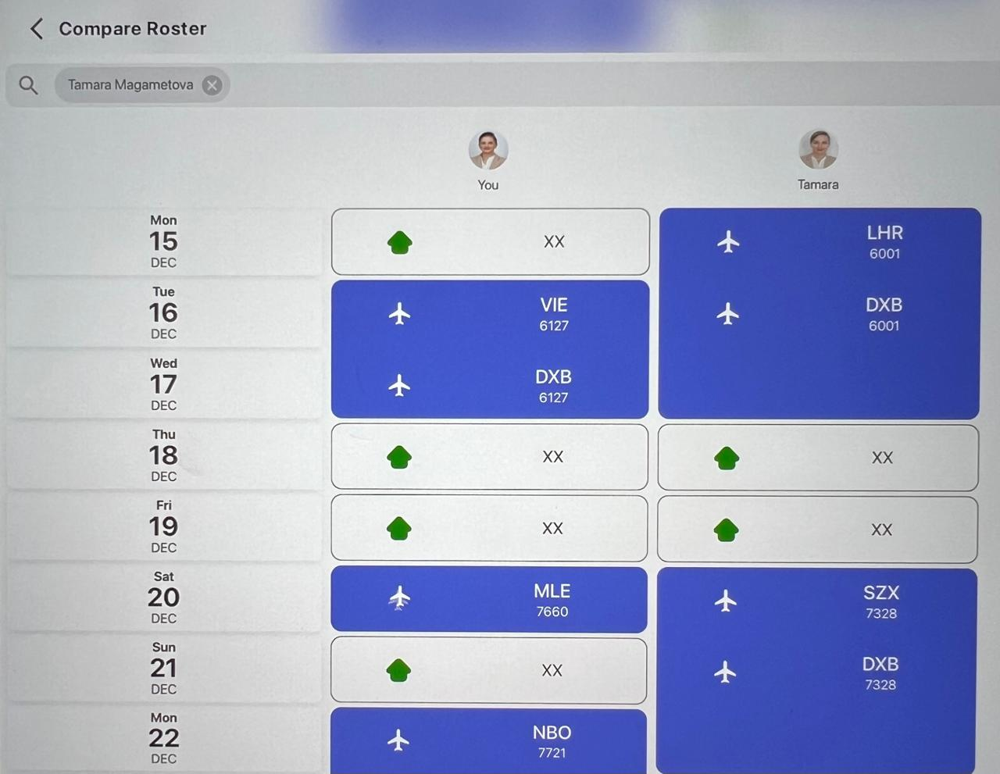

# Friends Page & Roster Comparison – Phased Delivery Plan

This document describes how we will redesign the Friends experience (left-hand friend list + roster comparison grid) in safe, reviewable phases. Each phase produces a feature branch, a focused PR, and a manual QA gate performed by the user before we move forward. Lint must pass at the end of every phase.

## ✅ PROGRESS UPDATE (Nov 27, 2025)

**Phases 1-4 COMPLETE - Phase 4 awaiting PR merge**

- ✅ Phase 1: Data & Context Enhancements - MERGED
- ✅ Phase 2: Friend List Sidebar Component - MERGED
- ✅ Phase 3: Friends Page Layout Integration - MERGED
- ✅ Phase 4: Roster Comparison Grid Redesign - COMPLETE
- ⏳ Phase 5: Final QA & PR Handoff - IN PROGRESS

**What's Live:**

- Database migration applied (first_name, last_name, avatar_url in profiles)
- FriendListSidebar component with search and avatar support
- Integrated two-column layout on Friends page
- ✅ NEW: Calendar-style roster comparison grid
- ✅ NEW: Duty tiles (flight, off-day, standby)
- ✅ NEW: Day-by-day roster mapping utilities
- All lint passing, TypeScript compiling, QA complete

**Next Steps:**

- Merge Phase 4 PR to main
- Phase 5: Final cleanup and celebration! 🎉

---

## Guiding Principles & Constraints

1. **No duplication / respect existing patterns** – Extend the current data layer (`src/lib/database/friends.ts`, `useFriends`, etc.) instead of introducing parallel APIs or component systems.
2. **Avatar fallbacks** – Every friend may lack an `avatar_url`. We derive initials (first letter of first name; fallback to email) and reuse existing avatar styles so the UI stays consistent.
3. **Type safety first** – Update shared TypeScript types and fix any downstream breakage immediately; never introduce `any`.
4. **UI consistency** – Keep Add Friend + Pending Requests cards above the new layout, per user direction. Avoid layout regressions on mobile.
5. **Tests & lint** – Run `pnpm lint` (or the project’s lint command) at the end of every phase and include results in the PR description.

---

## GitHub Workflow

1. **Branch naming** – `feature/friends-phase-0-planning`, `feature/friends-phase-1-data`, etc.
2. **One phase per branch** – Never mix scope between phases; if a later phase needs an earlier change, rebase/merge the latest `main` after that phase is approved.
3. **Manual QA gate** – After lint passes, deliver the branch for user testing. Wait for “OK” before committing locally.
4. **Commit & PR etiquette**
   - Squash commits per phase (e.g., `feat(friends): add friend sidebar component`).
   - Open PR targeting `main`, include:
     - Summary of work.
     - Testing checklist (manual steps + `pnpm lint` output).
     - Outstanding follow-ups (if any).
   - User handles merge + branch deletion.

---

## Phased Implementation

### Phase 0 – Planning & Setup

**Goal:** Produce this plan, confirm workflow, and ensure the repo is ready.

- Add `docs/friends-redesign-plan.md` (this file) and review it with the user.
- Validate existing contexts/hooks (FriendsProvider + useFriends) to understand data flow.
- Outcome: approved plan + clear branch strategy.

**Definition of done**

- Plan reviewed and accepted.
- Baseline lint (`pnpm lint`) run to ensure repo is clean.

---

### Phase 1 – Data & Context Enhancements ✅ COMPLETE

**Status:** MERGED to main (Nov 27, 2025)

**Goal:** Enrich friend data so UI work has everything it needs.

- Extend `FriendWithProfile` / `PendingRequest` to include `firstName`, `lastName`, `avatarUrl`.
- Update Supabase queries in `src/lib/database/friends.ts` to select those fields.
- Add derived helpers (e.g., `getFriendDisplayName`, `getFriendInitial`) so components stay DRY.
- Update `useFriends` consumers (Friends page, sidebar, RosterComparison modal) to use the richer data.

**Definition of done**

- TypeScript compiles with new fields; no `any`.
- Lint passes.
- Manual QA: ensure existing Friends page loads, displays old info, and roster comparison still opens.

---

### Phase 2 – Friend List Sidebar Component ✅ COMPLETE

**Status:** MERGED to main (Nov 27, 2025)

**Goal:** Implement the left-hand list with avatars/initials and selection UX.

- Create `src/components/friends/FriendListSidebar.tsx`:
  - Avatar/initial display.
  - Friend name + airline/position.
  - Search/filter input (client-side).
  - Loading + empty states.
  - “Active” styling for selected friend.
- Expose callbacks so the Friends page can update `selectedFriend`.
- Keep component responsive (collapsible on small screens).

**Definition of done**

- Storybook-style manual test (if available) or in-page verification.
- Lint passes.
- Manual QA: verify list renders, selecting friend updates `selectedFriend`, fallback initial works without avatar.

---

### Phase 3 – Friends Page Layout Integration ✅ COMPLETE

**Status:** MERGED to main (Nov 27, 2025)

**Goal:** Wire the sidebar + roster comparison into the page layout.

- Update `src/app/(dashboard)/friends/page.tsx`:
  - Keep Add Friend + Pending Requests cards on top.
  - Below, create responsive two-column layout:
    - Left: `FriendListSidebar`.
    - Right: Roster comparison canvas (shows prompting state when no friend selected).
  - Ensure mobile view stacks vertically; provide fallback CTA on small screens.
- Remove the old "Roster Comparison" card block triggered by `selectedFriend`.
- Verify contexts and selection logic still work.

**Definition of done**

- Layout responsive across breakpoints (Tailwind classes).
- Lint passes.
- Manual QA: add friend, select friend, view roster grid, confirm nothing overlaps.

---

### Phase 4 – Roster Comparison Grid Redesign ⏳ PENDING

**Goal:** Replace the dual-column card list with the calendar-style grid from the reference design.

**Reference Screenshot:** `public/images/friends_screenshot.jpeg`



#### Visual Specifications (from reference)

| Element               | Style                                                                                                           |
| --------------------- | --------------------------------------------------------------------------------------------------------------- |
| **Header**            | Back button, search bar with selected friend chip (pill with X), two avatar columns labeled "You" / friend name |
| **Grid layout**       | 3 columns: Date column (left) + User duties (center) + Friend duties (right)                                    |
| **Date column**       | Day name (Mon/Tue/etc), large day number, month abbreviation (DEC)                                              |
| **Flight tile**       | Blue filled background, white airplane icon (left), airport code (bold), flight number below                    |
| **Off-day tile**      | Gray/white outlined, green house icon (left), "XX" text                                                         |
| **Multi-day flights** | Single tile spans multiple rows (e.g., layover: VIE on Tue → DXB on Wed, same flight 6127)                      |
| **Row alignment**     | Fixed row height so dates align across both user/friend columns                                                 |

---

#### Phase 4a – Day Grid Utilities & Data Mapping

**Goal:** Build the data layer for per-day roster mapping.

- Create `src/lib/roster-comparison/` utilities:
  - `generateMonthDays(year, month)` → array of day objects with date, dayName, dayNumber
  - `mapDutiesPerDay(duties, days)` → maps duty data to each day, handling multi-day flights
  - `getDutyDisplayInfo(duty)` → returns icon type, airport code, flight number, tile style
- Handle layover/multi-day duty merging (duty spans multiple days = single visual tile across rows)
- Export types for `DayWithDuties`, `DutyTileData`

**Definition of done:**

- Utilities work with existing duty data structure
- TypeScript types exported
- Unit-testable logic (pure functions)
- Lint passes

---

#### Phase 4b – Tile Components

**Goal:** Build reusable tile components matching the reference design.

- Create `src/components/friends/roster-tiles/`:
  - `FlightTile.tsx` – Blue background, airplane icon, airport code, flight number
  - `OffDayTile.tsx` – Outlined style, green house icon, "XX" text
  - `EmptyTile.tsx` – Placeholder for days with no data
- Props: `airportCode`, `flightNumber`, `isMultiDay`, `position` (start/middle/end for spanning tiles)
- Consistent height for row alignment
- Responsive sizing

**Definition of done:**

- Tiles render correctly in isolation
- Styles match reference (blue fill for flights, outlined for off-days, green house icon)
- Lint passes

---

#### Phase 4c – Grid Layout & Header

**Goal:** Assemble the full comparison grid with header.

- Update `RosterComparison.tsx`:
  - **Header section:**
    - Back/close button
    - Search bar showing selected friend as removable chip
    - Two avatar columns with labels ("You" / friend name)
  - **Grid section:**
    - Date column (day name, number, month)
    - User column with duty tiles
    - Friend column with duty tiles
  - Handle multi-day tile spanning (CSS grid `grid-row` or absolute positioning)
- Add month navigation controls (previous/next month)
- Loading and empty states

**Definition of done:**

- Layout matches reference screenshot
- Multi-day flights span correctly
- Dates align across columns
- Lint passes

---

#### Phase 4d – Integration & Polish

**Goal:** Wire everything together and handle edge cases.

- Connect grid to existing `useFriends` and duty data
- Handle scenarios:
  - Friend has no roster data for selected month
  - User has no roster data
  - Mixed duty types (flights, off-days, standby, etc.)
- Mobile responsiveness (horizontal scroll or stacked view)
- Smooth scrolling for long months
- Remove old comparison card UI if still present

**Definition of done:**

- Full integration working end-to-end
- Edge cases handled gracefully
- Mobile usable
- Lint passes
- Manual QA: compare several months, confirm alignment and loading states

---

### Phase 5 – Final QA & PR Handoff ⏳ PENDING

**Goal:** Wrap up Phase 4 and prepare PR after user sign-off.

- Run full lint/test suite (`pnpm lint`, `pnpm test` if applicable).
- Capture screenshots/gifs for PR.
- Provide summary + checklist for user review.
- After user confirms, push branch and open PR. Await merge instructions.

---

## Testing & Lint Checklist (per phase)

1. `pnpm install` (once if dependencies changed).
2. `pnpm lint`.
3. Manual validation steps listed under each phase’s definition of done.
4. Document anything untested (e.g., mobile view) so the user can cover it.

---

## Next Actions (For Resuming Development)

**Current State:**

- ✅ Phases 1-3 are complete and merged to main
- ✅ All local and remote branches cleaned up
- ✅ Database migration applied
- ✅ Friends page functional with new sidebar

**To Resume Phase 4:**

1. **Create new feature branch:**

   ```bash
   git checkout main
   git pull origin main
   git checkout -b feature/friends-phase-4-grid-redesign
   ```

2. **Review reference design:** `public/images/friends_screenshot.jpeg`

3. **Execute sub-phases in order:**

   | Sub-phase | Focus           | Key Deliverables                                                |
   | --------- | --------------- | --------------------------------------------------------------- |
   | **4a**    | Data utilities  | `src/lib/roster-comparison/` - day generation, duty mapping     |
   | **4b**    | Tile components | `src/components/friends/roster-tiles/` - FlightTile, OffDayTile |
   | **4c**    | Grid layout     | Update `RosterComparison.tsx` - header, 3-column grid           |
   | **4d**    | Integration     | Wire data, handle edge cases, mobile, polish                    |

4. **Key files to create/modify:**

   - `src/lib/roster-comparison/dayUtils.ts` - Day generation utilities
   - `src/lib/roster-comparison/dutyMapping.ts` - Duty-to-day mapping
   - `src/components/friends/roster-tiles/FlightTile.tsx`
   - `src/components/friends/roster-tiles/OffDayTile.tsx`
   - `src/components/friends/roster-tiles/EmptyTile.tsx`
   - `src/components/friends/roster-tiles/index.ts`
   - `src/components/friends/RosterComparison.tsx` - Main redesign target

5. **After each sub-phase:**

   - Run `pnpm lint`
   - Quick manual verification
   - Continue to next sub-phase (no separate PRs needed)

6. **After Phase 4 complete:**
   - Run Phase 5 (final QA)
   - Create PR similar to Phases 1-3
   - Merge and celebrate! 🎉

**Reference Documentation:**

- `docs/phase-1-summary.md` - Data layer implementation details
- `docs/phase-2-summary.md` - Sidebar component details
- `docs/phase-1-completion.md` - QA verification checklist
